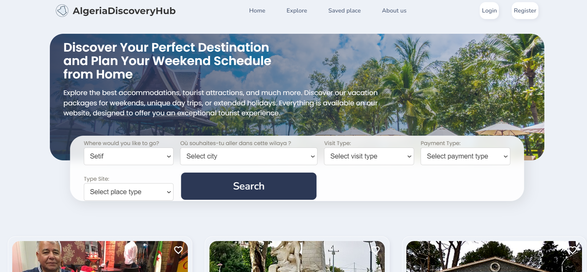

### Contact

If you want to contact with me you can reach me at  Email :: islamaiouni@gmail.com 

### How to Run the proejct 

For execute the Website you need run this after isntall xammp and run phpmyamdin and run datasbaese named islamda            you can run http://localhost/ridex1/index.php     


# Algeria Discovery HuB 

Welcome to the AlgeriaDiscoveryHuB  project repository. This project is a web application developed using PHP, MySQL, JavaScript, HTML, CSS, and Bootstrap. It also uses phpMyAdmin for database management and is set up to run on XAMPP. THis project desgined to make your life easier. Help popele algerian or not algerian to make next trip plan easy in algeria with advanced search for any sites tourstqiue exist in agleria desginde with Easy and modern user interface for make you expresione in this website unique  
 and Also "Our website features an option to discover nearby tourist sites, allowing users to explore and uncover nearby tourist attractions directly from our platform." 
## Databease named islamda

the Databease in our website in phpMyAdmin named islamda    you can create new databease and import our databease you can find it in file called databease.sql

## Installation

To set up the project locally, follow these steps:

1. **Download and Install XAMPP:**
   - [XAMPP Download Link](https://www.apachefriends.org/index.html)

2. **Clone the Repository:**
   ```bash
   
Move the Project Files:

Move the cloned repository folder RideX1 into the htdocs directory of your XAMPP installation.
Start XAMPP:

Open XAMPP Control Panel and start Apache and MySQL.
Set Up the Database:

Open phpMyAdmin by navigating to http://localhost/phpmyadmin/.
Create a new database named islamda.
Import the provided SQL file (databease.sql) from the project folder into the newly created database.
Running the Project
To run the project, open your web browser and navigate to:


http://localhost/ridex1/index.php

Technologies Used
sql 
PHP: Server-side scripting language.
MySQL: Relational database management system.
JavaScript: Client-side scripting.
HTML: Markup language for creating web pages.
CSS: Style sheet language for designing web pages.
Bootstrap: Front-end framework for responsive web design.
phpMyAdmin: Tool for MySQL database management.
XAMPP: Free and open-source cross-platform web server solution stack package.
Notes
Make sure your XAMPP server is running when you try to access the project in your web browser.
Ensure that you have configured the database correctly in the config.php or similar configuration file.
Feel free to contribute to this project by submitting pull requests or opening issues for any bugs or feature requests.


### Some page for understanding here name :

index.php : is the landign page for our website
search.php : is the search page for our website
details.php : is the detail page for our website
header.php : is the header for our website
favori.php : is the favorites   page for our website
assest folder contiet images for our website and some css 


### Demo Screeshots



Thank you for using AlgeriaDiscoveryHub  RideX1!

